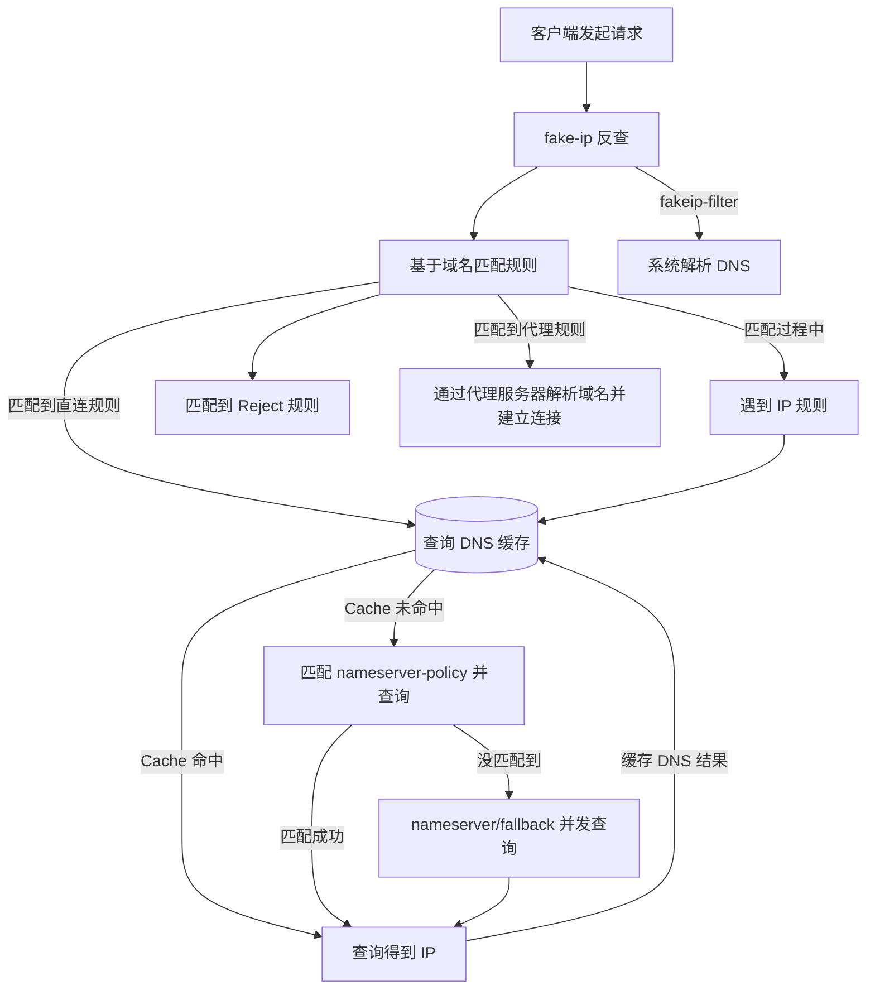

## 引子

前段时间对博客进行了整理和翻新，趁着记忆还没完全模糊，将搭建博客的细节记录下来。个人而言，对目前博客的各项功能以及美观度还是比较满意的，而这些背后也付出了一定的努力，希望也对其他想折腾博客的人有些许帮助，那样就更好了！也作为博客分类「折腾」的第一篇，送给自己~

注意：博客的主题是基于 Hugo 的 [PaperMod](https://github.com/adityatelange/hugo-PaperMod) 进行魔改，故而诸多相关细节未必适用于其他博客框架，请阅读理解后进行使用。另外，本博客相关源码也放在此，方便进行查阅



关于本文涉及的一些用法示例，可以参见本篇文章的[源码](https://github.com/sherlcok314159/MyPaperMod/blob/main/content/posts/hugo-journey.md)

## 基础知识

这里主要介绍 Hugo 主题相关的基础知识，比如文件夹代表的意思，我使用的 Hugo 版本以及常用命令等，有基础的读者应直接跳至下一节进行阅读

### 组成

开始之前，先说明一个比较重要的事情，你会发现 layouts 和 assets 在 themes 下某个主题里也有，不要在主题里进行修改，否则当你主题更新后，就比较麻烦，正确做法应该是在 themes 同级目录创建

以下即为一个 Hugo 主题常见的组成结构：

```bash
|—— assets # 放置 css 和 js
    |—— css
    |—— js
|—— content # 放置网站内容，比如 posts，或者 friends.md
    |—— posts
        |—— hello-world.md
    friends.md # 友链内容
|—— data # 我是只放了 SVG.toml 文件
|—— layouts # 控制网站相关的布局
    |—— _default # 主题内置的布局，如 single.html 代表一个帖子的布局
    |—— partials # 放置你个人魔改的部件
        |—— extend_footer.html # 代码会添加到原网站的 footer 里
        |—— extend_head.html # 代码会添加到原网站的 head 里
    |—— shortcodes # 一些好玩的 shortcodes 命令
|—— public # 渲染后的纯 HTML 代码，刚下载未渲染不会有该目录
|—— resources # 一般不用管
|—— static # 网站的字体以及 icon 放置目录
    |—— fonts
    favicon.ico
|—— themes
    |—— PaperMod
config.yaml # 网站的配置文件
```

content 目录下的路径关系，即为网站上的链接顺序，比如 hello-world.md 访问链接便为：`域名/posts/hello-world/`，而 friends.md 便为 `域名/friends`

BTW，如果想在文章中引用博客内容，可以省去域名`[hello-world](/posts/hello-world)`


另外，Hugo 新手可能不知道 shortcodes 是啥意思，可以理解为一种快捷指令，具体的意思也可去 [Hugo 官网](https://hugo.opendocs.io/) 查看

config.yaml 里面可以放置全局参数以及 menu 等信息，根据你所使用的主题文档进行修改即可。这里举个简单的例子，假如你希望你的网站遵循浏览器的亮暗偏好来加载，在 PaperMod 里就可以这样设置：

```yaml
params:
  ... # 其他参数
  defaultTheme: auto
```

### 调试和发布

我的 Hugo 一直是使用老版本：

```bash
hugo version
# hugo v0.117.0-b2f0696cad918fb61420a6aff173eb36662b406e linux/amd64 BuildDate=2023-08-07T12:49:48Z VendorInfo=gohugoio
```

Hugo 常用的也就两个命令：

```bash
hugo server # 进行本地调试
hugo # 正式渲染，结果在 public，将 public 上传至支持静态站的地方即可发布
```

另外关于 Hugo 中常见的变量以及支持的方法，也应该去官网查看更详细的记录，还有时常在 Hugo HTML 中出现的，类似如下内容是属于「Go」的[模板函数](https://hugo.opendocs.io/functions/go-template/)，不只是 Go，如果有任何疑问，查看官网 doc 永远是第一选择

```go
{{ if or .Params.math .Site.Params.math }}
...
{{ end }}
```

有了如上的基础知识后，我们可以来愉快的进行精装修了

## 数学公式

`$a=b$` 这是行内公式

这是行间公式
`$$
e=mc^2
$$`

对于写技术 blog 的同志们来说，数学公式的适配几乎是必须的，然而很多主题未对数学公式进行适配，或者只是比较随意的适配（有些情况还是不会 work），我使用的这个主题作者就在 [GitHub issues](https://github.com/adityatelange/hugo-PaperMod/issues/236) 里贴了所谓的实现方案，内容如下：

```go
{{ if or .Params.math .Site.Params.math }}
<link rel="stylesheet" href="https://cdn.jsdelivr.net/npm/katex@0.12.0/dist/katex.min.css" integrity="sha384-AfEj0r4/OFrOo5t7NnNe46zW/tFgW6x/bCJG8FqQCEo3+Aro6EYUG4+cU+KJWu/X" crossorigin="anonymous">
<script defer src="https://cdn.jsdelivr.net/npm/katex@0.12.0/dist/katex.min.js" integrity="sha384-g7c+Jr9ZivxKLnZTDUhnkOnsh30B4H0rpLUpJ4jAIKs4fnJI+sEnkvrMWph2EDg4" crossorigin="anonymous"></script>
<script defer src="https://cdn.jsdelivr.net/npm/katex@0.12.0/dist/contrib/auto-render.min.js" integrity="sha384-mll67QQFJfxn0IYznZYonOWZ644AWYC+Pt2cHqMaRhXVrursRwvLnLaebdGIlYNa" crossorigin="anonymous"
    onload="renderMathInElement(document.body);"></script>
{{ end }}
```

看似基本的公式可以正常显示，然而，当公式复杂起来，上述方案就不会 work 了，比如：

```tex
$$
\frac{\partial E(\boldsymbol{w})}{\partial z_j} = \sum\limits_{k}\frac{\partial E(\boldsymbol{w})}{\partial y_{k}}\frac{\partial y_k}{\partial z_{j}}= \sum\limits_{k} (y_{k}- \hat{y}_{k}) w_{kj}^{(2)} \tag{5.11}
$$
```

有了可以渲染数学元素的工具还不够，因为你还需要保证公式的内容并没有进行修改。举个例子，当你想要渲染 a_{1} + b_{1}，而 Hugo 可能将下划线渲染成 markdown 的模式：`a<em>1 + b</em>1`，导致 mathjax 去渲染的时候找不到你原来的公式，进而导致了渲染的失败。解决方案是将带有公式的部分先用代码 block 装饰起来，避免内容被修改，接着再将代码 block 去掉，完整的送给渲染工具

借鉴了[谢益辉](https://yihui.org/cn/2017/04/mathjax-markdown/)的相关实现


在 layouts/partials/extend_footer.html 中复制以下 js 代码：


```js
<script>
  (function () {
    var i, text, code, codes = document.getElementsByTagName("code");
    for (i = 0; i < codes.length; ) {
      code = codes[i];
      if (code.parentNode.tagName !== "PRE" && code.childElementCount === 0) {
        text = code.textContent;
        if (/^\$[^$]/.test(text) && /[^$]\$$/.test(text)) {
          text = text.replace(/^\$/, "\\(").replace(/\$$/, "\\)");
          code.textContent = text;
        }
        if (
          /^\\\((.|\s)+\\\)$/.test(text) ||
          /^\\\[(.|\s)+\\\]$/.test(text) ||
          /^\$(.|\s)+\$$/.test(text) ||
          /^\\begin\{([^}]+)\}(.|\s)+\\end\{[^}]+\}$/.test(text)
        ) {
          code.outerHTML = code.innerHTML; // remove <code></code>
          continue;
        }
      }
      i++;
    }
  })();
</script>
```


接着在 layouts/partials/extend_head.html 中引用 layouts/partials/mathjax.html：由全局和网站变量来共同决定是否进行数学公式渲染

上述文件若是不存在则自己创建


```go
{{ if or .Params.math .Site.Params.math }}
{{- partial "mathjax.html" .}}
{{ end }}
```

mathjax.html 的内容如下，当然我这里还加了额外的 boldsymbol 包，没有需求的可以去掉


```html
<script>
  MathJax = {
    loader: { load: ["[tex]/boldsymbol"] },
    tex: {
      inlineMath: [
        ["`$", "$`"],
        ["\\(", "\\)"],
      ],
      displayMath: [
        ["`$$`", "`$$`"],
        ["\\[", "\\]"],
      ],
      processEscapes: true,
      processEnvironments: true,
      tags: "all",
      packages: { "[+]": ["boldsymbol"] },
    },
  };
</script>

<script
  src="https://cdn.jsdelivr.net/npm/mathjax@3.2.2/es5/tex-chtml-full.js"
  integrity="sha256-kbAFUDxdHwlYv01zraGjvjNZayxKtdoiJ38bDTFJtaQ="
  crossorigin="anonymous"
></script>
```


至此，数学公式的渲染问题就解决好了，使用时把原本的公式放入 code block 即可：

```md
`$a=b$` 行内公式
以下是行间公式
`$$
e=mc^2
$$`
```

## 评论系统

评论系统用过很多，比如用 GitHub 来驱动，或者自部署类比如 [Waline](https://waline.js.org/)，之前一直是用 Waline，有表情包，也支持邮箱通知等。但是，技术 blog 的评论系统怎么能没有「公式的集成」呢？所以我选择了[Artalk](https://yunpengtai.top/posts/hello-world/)，支持公式，表情，邮箱通知，自动亮暗模式等，功能很全，作者也在积极更新~

概念上 Artalk 分为前后端以及存储所需要的数据库，先讲前端的配置，创建 layouts/partials/artalk.html，内容如下，因为我需要用到 katex，故而引入了其 css 和 js 相关的文件，读者应根据自己需要进行取舍

最重要的是根据浏览器的偏好以及读者对网站的偏好来设置亮暗，首先第一次加载时网站和 Artalk 会按照浏览器的偏好来加载。接着，如果读者点击了网站的「亮暗切换按钮」，那么以后的加载就遵循网站的亮暗偏好，而非浏览器的偏好。实现的逻辑大概就是通过一些 element 来获取当前的偏好，不同主题的 element id 势必会有些许不同，故而不可照抄~


```html
<!-- Artalk Doc 默认是 unpkg 的 CDN，尽量不要用，国内连通性不好 -->
<link
  rel="stylesheet"
  href="https://cdn.jsdelivr.net/npm/katex@0.16.7/dist/katex.min.css"
  integrity="sha384-3UiQGuEI4TTMaFmGIZumfRPtfKQ3trwQE2JgosJxCnGmQpL/lJdjpcHkaaFwHlcI"
  crossorigin="anonymous"
/>
<script
  src="https://cdn.jsdelivr.net/npm/katex@0.16.7/dist/katex.min.js"
  integrity="sha384-G0zcxDFp5LWZtDuRMnBkk3EphCK1lhEf4UEyEM693ka574TZGwo4IWwS6QLzM/2t"
  crossorigin="anonymous"
></script>

<script src="https://cdn.jsdelivr.net/npm/artalk@2.8.6/dist/Artalk.min.js"></script>
<script src="https://cdn.jsdelivr.net/npm/@artalk/plugin-katex@0.2.4/dist/artalk-plugin-katex.min.js"></script>

<div id="Comments"></div>
<script>
  const savedTheme = localStorage.getItem("pref-theme");
  let darkMode = "auto";
  // 查看网站是否已经设置了亮暗偏好
  if (savedTheme !== null) {
    darkMode = savedTheme === "dark" ? true : false;
  }
  const artalk = Artalk.init({
    el: "#Comments", // 绑定元素的 Selector
    pageKey: "",
    pageTitle: "{{ .Title }}",
    server: "{{ site.Params.artalk.server }}", // 后端地址
    site: "{{ site.Params.artalk.site }}", // 你的站点名
    darkMode: darkMode, // 首次打开时自动亮暗模式
    versionCheck: false, // 不提醒需要更新，还需要后端也设置，后端 > 前端
  });
  document.getElementById("theme-toggle").addEventListener("click", () => {
    document.body.className.includes("dark")
      ? artalk.setDarkMode(!1)
      : artalk.setDarkMode(!0);
  });
</script>
```


另外，关于停用版本检测，不仅要设置前端的参数，后端的参数也需要设置为 false，具体即为 render 上的 conf.yaml

接着在同级目录中创建 comments.html 来引用即可：

```go
{{ if or .Params.comments .Site.Params.comments }}
{{- partial "artalk.html" .}}
{{ end }}
```

关于数据库以及后端部署的部署，很大程度得益于这位网友的[帖子](https://zhuanlan.zhihu.com/p/667881783)，重复内容就不多赘述，我选择的是 Neon+Render 来分别部署数据库和后端，关于 Render 部署的详细文件，可以参考[这里](https://github.com/LeenHawk/artalk-on-render)。这里为表情包多做一条说明，如果是希望网站支持表情包，则在 conf.yaml 中的 emoticons 项中加入表情包的远程链接

```yaml
emoticons: link_to_artalk.json
```

关于此文件的具体格式，可以参考我的表情包[配置仓库](https://github.com/sherlcok314159/artalk-assets/blob/main/artalk.json)，至此，评论系统集成也已经完毕。当然，本网站的 artalk 看上去可能与你们的有些许不同，比如表情包的大小以及没有头像，我自己又改了一些 CSS 来完成上述目标，创建 assets/css/extended/artalk.css，将 artalk 对应的 [CSS](https://cdnjs.cloudflare.com/ajax/libs/artalk/2.9.1/Artalk.css) 内容复制进去，然后修改为以下内容，如果没搜到对应的 CSS 项，就直接新建即可（关于字体的导入，在[字体设置](/posts/hugo-journey/#字体)）


```css
/* 改变表情包大小 */
img[atk-emoticon] {
  width: 5em;
  height: auto;
  display: initial;
}
/* 下列内容可能存在于原来的 CSS 文件内，请查找后进行修改 */
.atk-comment > .atk-avatar img {
  width: 50px;
  height: 50px;
  border-radius: 3px;
  display: none; /* 移除头像 */
}

/* artalk 代码相关的字体与正文对齐 */
.artalk code,
.atk-layer-wrap code {
  font-family: "Consolas", "LXGWWenKaiScreenR";
  margin: 0 0.05em;
  padding: 0 0.4em;
  display: inline-block;
  vertical-align: middle;
  font-size: 0.9em;
  background-color: var(--at-color-bg-grey);
  color: var(--at-color-font);
  border-radius: 2px;
}
.artalk pre code *,
.atk-layer-wrap pre code * {
  font-family: "Consolas", "LXGWWenKaiScreenR";
}
```


至于字体方面，等后面讲网站字体介绍即可，并未加其他特殊设置。关于邮箱通知，你需要去专门进行相关设置，请根据官方文档进行，比较简单，这里进行省略

## 更好看

这一节主要讲为了博客变得更好看做的改变

### 字体

我对博客的字体向来是比较挑剔，而且这很影响读者的观感，我比较喜欢[霞鹜文楷](https://github.com/chawyehsu/lxgw-wenkai-webfont)，这款字体好看而且是开源的。不过该字体可不小，对于个人的轻量级 blog 来说，还是存在着优化的可能性，故而，我在博客上使用的是 woff2 格式文件，大小只有 2 M，直接放到了 static/fonts 目录，有需要可以去我的仓库里下载。同时英文使用 Apple 的字体 SF Pro Text Regular 来渲染，然后用 CSS 来控制字体加载即可：


```css
@font-face {
  font-family: "LXGWWenKaiScreenR";
  src: url("/fonts/lxgwwenkaiscreen.subset.v1.235.standard.woff2");
}

/* https://www.webfontfree.com/cn/download/SFProText-Regular */
@font-face {
  font-family: "SFProText-Regular";
  src: url("/fonts/SFProText-Regular.woff2");
}

body {
  font-family: "SFProText-Regular", "LXGWWenKaiScreenR";
  font-size: 16px;
  line-height: 1.6;
  word-break: break-word;
  background: var(--theme);
  font-display: swap;
}
```


### 代码渲染

代码渲染的主题其实也是见仁见智吧，我个人是选择了[atom-one-dark/light](https://github.com/highlightjs/highlight.js/blob/main/src/styles/atom-one-light.css)

这里提供一下修改方法，因为我们需要覆盖掉原先主题对于代码渲染的设置，所以在 assets/css/hljs 中创建 an-old-hope.min.css ，注意，必须为该名字，当然如果是 Hugo PaperMod 主题肯定另有不同，然后直接复制相关的 CSS 进去。

这里唯一需要注意的是亮暗模式的设置，对于亮色模式，直接拷贝 light 即可，但对于暗色来说，则需要一些特定的限定：

```css
body.dark {
  .hljs {
    color: #abb2bf;
    background: #282c34;
  }
  ...
}
```

同时，需要修改亮暗模式下代码框的背景颜色，这里是直接用变量来进行替代。然后关于代码的字体设置，笔者使用 Consolas 和霞鹜文楷（注释的中文字体）。为了防止有些读者并没有 Consolas 字体，这里保险起见还是下载下来。另外注意，因为我之前的 CSS 中加载了霞鹜文楷，如果你没有加载，还是需要多写一个 font-face


```css
@font-face {
  font-family: "Consolas";
  src: url("/fonts/Consolas.woff2");
}

code {
  font-family: "Consolas", "LXGWWenKaiScreenR";
}

.post-content code {
  margin: auto 4px;
  padding: 4px 6px;
  font-size: 0.8em;
  line-height: 1.5;
  background: var(--code-bg);
}

.post-content pre code {
  display: block;
  margin: auto 0;
  padding: 10px;
  background: var(--hljs-bg) !important;
  color: var(--content);
  border-radius: var(--radius);
  overflow-x: auto;
  word-break: break-all;
  font-family: "Consolas", "LXGWWenKaiScreenR";
  font-size: 15px;
}
```


亮暗相关的两个变量进行设置的地方在 assets/css/core/theme-vars.css 这里：


```css
/* 省略的内容请拷贝原先主题对应的文件 */
:root {
  ...
  --hljs-bg: #f7f7f7;
  --code-bg: rgb(245, 245, 245);
}

.dark {
  ...
  --hljs-bg: rgb(46, 46, 51);
  --code-bg: rgb(55, 56, 62);
}
```


### 表格

对主题自带的表格渲染也进行修改，同时适配亮暗模式，还是需要注意暗色模式下的设置

| 姓名 | 年龄 | 职业     |
|:------|:------|:----------|
| 张三 | 30   | 工程师   |
| 李四 | 25   | 设计师   |
| 王五 | 35   | 医生     |


```css
table {
  border-collapse: collapse;
  display: table;
  margin-bottom: 1rem;
  width: 100%;
  overflow-x: auto;
  -webkit-overflow-scrolling: touch;

  & thead th {
    vertical-align: bottom;
    border-bottom: 2px solid #dee2e6;
  }
  & td,
  & th {
    vertical-align: top;
    border-top: 1px solid #dee2e6;
    border-bottom: 1px solid #dee2e6;
  }

  & tbody tr:hover {
    background-color: rgba(0, 0, 0, 0.075);
  }

  & tbody tr:nth-of-type(2n + 1) {
    background-color: rgba(0, 0, 0, 0.05);
  }
  & tr:last-of-type {
    vertical-align: bottom;
    border-bottom: 2px solid #dee2e6;
  }
}

.dark table {
  border-collapse: collapse;
  display: table;
  margin-bottom: 1rem;
  width: 100%;
  overflow-x: auto;
  -webkit-overflow-scrolling: touch;

  & thead th {
    vertical-align: bottom;
    border-bottom: 2px solid var(--code-bg);
  }
  & td,
  & th {
    vertical-align: top;
    border-top: 1px solid var(--code-bg);
    border-bottom: 1px solid var(--code-bg);
  }

  & tbody tr:hover {
    background-color: var(--code-bg);
  }

  & tbody tr:nth-of-type(2n + 1) {
    background-color: var(--code-bg);
  }
  & tr:last-of-type {
    vertical-align: bottom;
    border-bottom: 2px solid var(--code-bg);
  }
}
```


### svg icon

觉得主页上的 icon 不太好看也可以进行修改，修改的方法就是将原来主题中的 layouts/partials/svg.html 拷贝到我们的 partials 目录，然后就选择自己想要的 icon 进行修改，这样就会覆盖了

## 更便于阅读

这一节主要讲博客为了更方便读者阅读做出的努力

### Mermaid 图



Mermaid js 可以可以让我们用代码的方式画流程图（如上图），在文章的概念比较多或者关系复杂时，流程图就可以让读者更容易看懂，故而也引入了 mermaid 的实现

首先创建 `layouts/_default/_markup/render-codeblock-mermaid.html`，写入以下内容：

```html
<!-- 因为正常写会有 ```meraid ... ``` -->
<pre class="mermaid">
   {{- .Inner | htmlEscape | safeHTML }}
</pre>
{{ .Page.Store.Set "hasMermaid" true }}
```

这样就可以将 mermaid 这种特殊的 codeblock 加入渲染机制里，同时设置 hasMermaid 为 true，方便后面判断是否加载 mermaid js。接着我们创建 `layouts/partials/mermaid.html`，来让 mermaid js 对我们写的代码进行渲染

同时支持亮暗自动切换，大部分代码片段取自于 [mermaid-js](https://github.com/mermaid-js/mermaid/issues/1945)社区的讨论，然而默认的代码是初次渲染是查看 localStorage 是否包含 pref-theme，很多时候用户并未手动点击切换是不会有这个值，即为 null。我这里是判断 `document.body.className` 是否包含 dark 来判断，更为准确

mermaid 的字体设置依然是对齐正文，使用`mermaid.init()`设置即可：


```html
{{ if .Page.Store.Get "hasMermaid" }}
<script src="https://cdn.jsdelivr.net/npm/mermaid@11/dist/mermaid.min.js"></script>
<script>
  const elementCode = ".mermaid";
  const loadMermaid = function (theme) {
    mermaid.initialize({ theme });
    mermaid.init({
      theme,
      themeVariables: { // 这里设置字体跟正文一致
        fontFamily: ["SFProText-Regular", "LXGWWenKaiScreenR"]
      }}, document.querySelectorAll(elementCode));
  };
  const saveOriginalData = function () {
    return new Promise((resolve, reject) => {
      try {
        var els = document.querySelectorAll(elementCode),
          count = els.length;
        els.forEach((element) => {
          element.setAttribute("data-original-code", element.innerHTML);
          count--;
          if (count == 0) {
            resolve();
          }
        });
      } catch (error) {
        reject(error);
      }
    });
  };
  const resetProcessed = function () {
    return new Promise((resolve, reject) => {
      try {
        var els = document.querySelectorAll(elementCode),
          count = els.length;
        els.forEach((element) => {
          if (element.getAttribute("data-original-code") != null) {
            element.removeAttribute("data-processed");
            element.innerHTML = element.getAttribute("data-original-code");
          }
          count--;
          if (count == 0) {
            resolve();
          }
        });
      } catch (error) {
        reject(error);
      }
    });
  };

  saveOriginalData().catch(console.error);
  // 不要用 localStorage.getItem("pref-theme")，因为有些时候会为 null
  let isdark = document.body.className.includes("dark");
  if (isdark) {
    resetProcessed().then(loadMermaid("dark")).catch(console.error);
  } else {
    resetProcessed().then(loadMermaid("neutral")).catch(console.error);
  }
  document.getElementById("theme-toggle").addEventListener("click", () => {
    resetProcessed();
    document.body.className.includes("dark")
      ? loadMermaid("neutral")
      : loadMermaid("dark").catch(console.error);
  });
</script>
{{ end }}
```


最后再在 `layouts/_default/single.html` 中加入引用 mermaid.html 的部分，注意，single.html 你如果一开始没有，需要先去主题 `themes/PaperMod/layouts/_default/single.html` 那里拷贝原来的 single.html 到上面这个地址

```html
<article>
  <!-- 省略上面的 -->
  {{- partial "mermaid.html" . }}
</article>
```

### 侧边悬浮目录

悬浮目录是比较重要的，原始的目录是固定在文章的顶部，这样不便于读者阅读时对目录有直观的把握，也不利于读者进行快速跳转。

在 assets/css/extended/toc.css 中添加代码即可

借鉴了 [sulvblog](https://github.com/xyming108/sulv-hugo-papermod/blob/main/assets/css/extended/toc.css) 的实现



```css
:root {
  --article-width: 650px;
  --toc-width: 230px;
}

.toc {
  margin: 0 2px 40px 2px;
  border: 1px solid var(--border);
  background: var(--entry);
  border-radius: var(--radius);
  padding: 0.4em;
}

.toc-container.wide {
  position: absolute;
  height: 100%;
  border-right: 1px solid var(--border);
  left: calc((var(--toc-width) * 0.9 + var(--gap)) * -1);
  top: calc(var(--gap) * 2);
  width: var(--toc-width);
}

.wide .toc {
  position: sticky;
  top: var(--gap);
  border: unset;
  background: unset;
  border-radius: unset;
  width: 100%;
  margin: 0 2px 40px 2px;
}

.toc details summary {
  cursor: zoom-in;
  margin-inline-start: 20px;
  padding: 12px 0;
}

.toc details[open] summary {
  font-weight: 500;
}

.toc-container.wide .toc .inner {
  margin: 0;
}

.toc .active {
  font-size: 110%;
  font-weight: 600;
  color: #614a85;
  text-decoration: underline;
}

.toc ul {
  list-style-type: circle;
}

.toc .inner {
  margin: 0 0 0 20px;
  padding: 0px 15px 15px 20px;
  font-size: 16px;

  /*目录显示高度*/
  max-height: 83vh;
  overflow-y: auto;
}

.toc .inner::-webkit-scrollbar-thumb {
  /*滚动条*/
  background: var(--border);
  border: 7px solid var(--theme);
  border-radius: var(--radius);
}

.toc li ul {
  margin-inline-start: calc(var(--gap) * 0.5);
  list-style-type: none;
}

.toc li {
  list-style: none;
  font-size: 0.95rem;
  padding-bottom: 5px;
}

.toc li a:hover {
  color: var(--secondary);
}
```


### 添加修改时间

原先的主题并没有显示「修改时间」的功能，这对于读者阅读起来并不是好事情，像我阅读时就会关注文章最后一次的修改日期，否则可能会过时

在 layouts/partials/post_meta.html 中加入以下内容即可：

```go
{{- if (.Param "ShowLastMod") -}}
    {{ if ne (.Lastmod.Format "2006-01-02") (.Date.Format "2006-01-02") }}
    {{- `$scratch.Add "meta" (slice (printf "Updated:&nbsp;%s" (.Lastmod.Format (.Site.Params.dateFormat | default "January 2, 2006")))) }}$`
  {{- end -}}
{{- end -}}
```

然后在具体的帖子里加入 lastmod 和 showLastMod 即可显示出修改的时间了

```yaml
---
title: 新的主题
date: 2022-06-19 11:10:00 +0800
lastmod: 2024-11-20 18:00:00 +0800
showLastMod: true
...
---
```

### MarginNote

这是示例

这是示例的侧边注解


很多时候想补充说明，或者引用某些内容时，常见的脚注就必须跳转到文章末尾进行阅读，然后读者还需要跳回来，这就十分不方便，而 MarginNote 则并不会有这些问题，借由 MarginNote， 就可以在文章的侧边来显示信息，读者阅读起来也会方便很多

借鉴了 [kennethfriedman](https://kennethfriedman.org/thoughts/2019/marginal-notes/) 和 [scripter](https://scripter.co/sidenotes-using-only-css/)


首先来说相关的 CSS，主题的实现也是通过 CSS 来进行实现，以及 sidenote number 的增减，不过有些时候会有 bug，故而，为了方便起见，我索性将 number 变为固定的「#」，显示起来也比较美观


```css
.sidenote {
  float: right;
  position: relative;
  margin-right: -18vw;
  width: 40%;
  max-width: 200px;
}
body {
  counter-reset: sidenote-counter;
}
.sidenote-number {
  counter-increment: sidenote-counter;
}
.sidenote::before {
  content: "# ";
  position: relative;
  font-size: 0.9em;
  font-weight: 700;
  color: red;
}
.sidenote-number::after {
  content: "#";
  vertical-align: super;
  font-size: 0.8em;
  font-weight: 700;
  color: #409dff;
}
.sidenote-number:hover .sidenote {
  background-color: var(--sidenote-bg);
}
```


光有 CSS 还不够，我们上面定义的这些特殊的 HTML 元素，都得创建才行，在 layouts/shortcodes/sidenote.html 中写入以下内容

```html
<span class="sidenote-number"><small class="sidenote">{{ .Inner | markdownify }}</small></span>
```

.Inner 就代表是输入的内容，而 | markdownify 是为了支持 markdown 渲染，比如超链接等语法

### 图片点击放大



当图片细节很多或图片很大时，放在博客上就难免会进行大比例缩放，此时读者若是不能放大查看该图片，想必会十分苦恼，故而图片点击放大的功能也是必不可少的，具体是通过引入 [fancybox](http://fancybox.net/) 来实现：

在 layouts/shortcodes/figure.html 中填入以下内容即可


```html
<script src="https://cdn.jsdelivr.net/npm/jquery@3.4.1/dist/jquery.min.js"></script>

<link rel="stylesheet" href="https://cdn.jsdelivr.net/gh/fancyapps/fancybox@3.5.7/dist/jquery.fancybox.min.css" />
<script src="https://cdn.jsdelivr.net/gh/fancyapps/fancybox@3.5.7/dist/jquery.fancybox.min.js"></script>

<a data-fancybox="gallery" href="{{ .Get "src" }}">
<figure{{ if or (.Get "class") (eq (.Get "align") "center") }} class="
           {{- if eq (.Get "align") "center" }}align-center {{ end }}
           {{- with .Get "class" }}{{ . }}{{- end }}"
{{- end -}}>
    {{- if .Get "link" -}}
        <a href="{{ .Get "link" }}"{{ with .Get "target" }} target="{{ . }}"{{ end }}{{ with .Get "rel" }} rel="{{ . }}"{{ end }}>
    {{- end }}
     <!-- Closing img tag -->
    {{- if .Get "link" }}</a>{{ end -}}
    {{- if or (or (.Get "title") (.Get "caption")) (.Get "attr") -}}
        <figcaption>
            {{ with (.Get "title") -}}
                {{ . }}
            {{- end -}}
            {{- if or (.Get "caption") (.Get "attr") -}}<p>
                {{- .Get "caption" | markdownify -}}
                {{- with .Get "attrlink" }}
                    <a href="{{ . }}">
                {{- end -}}
                {{- .Get "attr" | markdownify -}}
                {{- if .Get "attrlink" }}</a>{{ end }}</p>
            {{- end }}
        </figcaption>
    {{- end }}
</figure>
</a>
```


当然上面还不止是增加了图片点击放大的功能，还加了 align，caption 等功能

### 盘古之白

个人认为，中文和英文以及数字之间有空格会更加便于阅读，这个空格也被称为「盘古之白」，像是劈开了这几者之间的混沌， 实现起来也十分简便：

在 layouts/partials/extend_footer.html 中加入以下内容：


```html
{{- `$highlight := resources.Get "js/pangu.min.js" }}$`
<script>
  (function (u, c) {
    var d = document,
      t = "script",
      o = d.createElement(t),
      s = d.getElementsByTagName(t)[0];
    o.src = u;
    if (c) {
      o.addEventListener("load", function (e) {
        c(e);
      });
    }
    s.parentNode.insertBefore(o, s);
  })("{{ $highlight.RelPermalink }}", function () {
    pangu.spacingPage();
  });
</script>
```


我这里是将 pangu.min.js 下载到了网站本地，具体是在 assets/js/pangu.min.js，当网站加载时，盘古之白会自动进行渲染

### 代码折叠


```python
print('Acc: 100%')
```


对于代码比较多的 blog，比如这篇，很多代码较长会影响阅读，占用很多篇幅，如果可以折叠，需要的时候点击展开就会很方便，折叠功能实现起来也比较方便，在 layouts/shortcodes/collapse.html 中加入以下内容：

```go
{{ if .Get "summary" }}
{{ else }}
{{ warnf "missing value for param 'summary': %s" .Position }}
{{ end }}
<p><details {{ if (eq (.Get "openByDefault") true) }} open=true {{ end }}>
  <summary markdown="span">{{ .Get "summary" | markdownify }}</summary>
  {{ .Inner | markdownify }}
</details></p>
```

## 版权声明

也许你也需要修改文章末尾的版权说明，那么就在 layouts/partials/post_copyright.html 中加入自己的版权声明即可

## 文章分类

有时候我们想要发表截然不同类型的文章，比如我主要会发深度学习以及 AI 相关的，但我也会写「折腾」相关的，就需要有不同的分类

先在 config.yaml 中加入以下内容：

```yaml
params:
  taxonomies:
    category: categories
    tag: tags
```

然后在写文章的时候，可以编辑文章的元信息来进行分类，同时还可以不在主页显示

```yaml
---
title: 新的主题
date: 2022-06-19 11:10:00 +0800
categories: [折腾]
hiddenInHomeList: true
...
---
```

但是不在主页显示后读者就不容易找到，此时我们在 config.yaml 中额外加个 menu 即可：

```yaml
menu:
  main:
    ...
    - identifier: categories
      name: 折腾
      url: /categories/折腾
      weight: 20
```

接着再寻找到 `layouts/_default/single.html` 中的 `post-meta` 类，在里面加入代码来让文章的元信息栏（显示时间，有多少词的地方）显示分类


```html
    <div class="post-meta">
      {{- partial "post_meta.html" . -}}
      {{- partial "translation_list.html" . -}}
      {{- partial "edit_post.html" . -}}
      {{- partial "post_canonical.html" . -}}
      <!-- 在元数据中显示分类信息 -->
      {{- $categories := .Language.Params.Taxonomies.category | default "categories"}}
      <!-- 统计分类个数 -->
      {{- $cnt := 0 }}
      {{- range ($.GetTerms $categories) }}
        {{- $cnt = add $cnt 1 }}
      {{- end }}
      <!-- 只有文章有分类信息时才显示 -->
      {{- if gt $cnt 0 }}
        {{- $i := 0 }}
        <div class="meta-item">&nbsp·&nbsp
            {{- range ($.GetTerms $categories) }}
                <a href="{{ .Permalink }}">{{ .LinkTitle }}</a>
                {{ $i = add $i 1 }}
                <!-- 不是最后一个类别时，添加逗号分割类别 -->
                {{- if lt $i $cnt}}
                    <span>,</span>
                {{- end }}
            {{- end }}
        </div>
      {{- end }}
    </div>
    {{- end }}
```


## Shortcodes 大赏

这里分享一些我比较常用的shortcode，也欢迎评论区分享你觉得有趣的

### 旋转的友链



当鼠标悬浮至友链所对应的头像时，头像便会开始进行旋转，这个还挺有趣的，首先在 assets/css/extended/friends.css 中加入以下内容：

借鉴了 [sulvblog](https://github.com/xyming108/sulv-hugo-papermod/blob/main/layouts/shortcodes/friend.html)



```css
.friendurl {
  text-decoration: none !important;
  color: black;
  box-shadow: none !important;
}

.myfriend {
  width: 56px !important;
  height: 56px !important;
  border-radius: 50% !important;
  padding: 2px;
  margin-top: 20px !important;
  margin-left: 14px !important;
  background-color: #fff;
}

.frienddiv {
  overflow: auto;
  height: 100px;
  width: 49%;
  display: inline-block !important;
  border-radius: 5px;
  background: none;
  -webkit-transition: all ease-out 0.3s;
  -moz-transition: all ease-out 0.3s;
  -o-transition: all ease-out 0.3s;
  transition: all ease-out 0.3s;
}

.dark .frienddiv:hover {
  background: var(--code-bg);
}

.frienddiv:hover {
  background: var(--theme);
  transition: transform 1s;
  webkit-transform: scale(1.1);
  -moz-transform: scale(1.2);
  -ms-transform: scale(1.2);
  -o-transform: scale(1.2);
  transform: scale(1.1);
}

.frienddiv:hover .frienddivleft img {
  transition: 0.9s !important;
  -webkit-transition: 0.9s !important;
  -moz-transition: 0.9s !important;
  -o-transition: 0.9s !important;
  -ms-transition: 0.9s !important;
  transform: rotate(360deg) !important;
  -webkit-transform: rotate(360deg) !important;
  -moz-transform: rotate(360deg) !important;
  -o-transform: rotate(360deg) !important;
  -ms-transform: rotate(360deg) !important;
}

.frienddivleft {
  width: 92px;
  float: left;
  margin-right: -5px;
}

.frienddivright {
  margin-top: 18px;
  margin-right: 18px;
}

.friendname {
  text-overflow: ellipsis;
  font-size: 100%;
  margin-bottom: 5px;
  color: var(--primary);
}

.friendinfo {
  text-overflow: ellipsis;
  font-size: 70%;
  color: var(--primary);
}

@media screen and (max-width: 600px) {
  .friendinfo {
    display: none;
  }
  .frienddivleft {
    width: 84px;
    margin: auto;
  }
  .frienddivright {
    height: 100%;
    margin: auto;
    display: flex;
    align-items: center;
    justify-content: center;
  }
  .friendname {
    font-size: 18px;
  }
}
```


接着在 layouts/shortcodes/friend.html 中加入以下内容：


```go
{{- if .IsNamedParams -}}
<a target="_blank" href={{ .Get "url" }} title={{ .Get "name" }} class="friendurl">
  <div class="frienddiv">
    <div class="frienddivleft">
      
    </div>
    <div class="frienddivright">
      <div class="friendname">{{- .Get "name" -}}</div>
      <div class="friendinfo">{{- .Get "word" -}}</div>
    </div>
  </div>
</a>
{{- end }}
```



### Blockquote


Basically, I’m not interested in doing research and I never have been… I’m interested in understanding, which is quite a different thing. And often to understand something you have to work it out yourself because no one else has done it. — David Blackwell


这个主题原来的 blockquote 较为丑，在 layouts/shortcodes/quote.html 加入以下内容

借鉴了 [Guan Qirui](https://guanqr.com/tech/website/hugo-shortcodes-customization/#quote)



```html
<blockquote class="quote{{ range .Params }} {{ . }}{{ end }}">
    {{- `$content := .Inner | markdownify -}}$`
    {{- if not (strings.HasPrefix `$content "<p>") }}$`
        {{ printf `<p>%s</p>` `$content | safeHTML }}$`
    {{- else }}
        {{- `$content }}$`
    {{- end -}}
</blockquote>
```


然后创建 assets/css/extended/quote.css 并加入以下内容


```css
blockquote.quote {
  position: relative;
  margin: 1em auto;
  padding-left: 3em;
  border: none;
}

blockquote.quote::before {
  position: absolute;
  left: 0;
  content: "“";
  font-size: 3em;
  font-weight: bold;
  line-height: 1;
}

blockquote.quote-copyright {
  position: relative;
  margin: 2em auto;
  padding-left: 3em;
  border: none;
  background-color: aliceblue;
}

blockquote.quote-copyright::before {
  position: absolute;
  left: 0;
  content: "“";
  font-size: 3em;
  font-weight: bold;
  line-height: 1;
}
```


### Github 小卡片

Github 仓库小卡片对我来说还是比较重要的，因为我一般代码都会进行开源，如果可以用一种卡片的方式提醒读者开源代码所在处，就省了读者去查找的功夫了，首先在 assets/css/extended/github.css 中填入以下内容：


```css
.github {
  border: 0px solid;
  border-radius: 5px;
  width: 95%;
  margin-bottom: 1em;
  margin-top: 1em;
  padding: 1em;
  background-color: var(--code-bg);
  .github_bar {
    margin-top: -0.6em;
    margin-left: 0;
  }
  .github_name {
    font-weight: bold;
    text-decoration: none;
    font-size: 24px;
    position: relative;
    top: -0.6em;
    left: 0.3em;
  }
  .github_description {
    margin-top: -0.3em;
    margin-bottom: 1em;
    color: var(--color-contrast-high);
    text-align: justify;
    font-size: 90%;
    width: 95%;
    transition: all 0.5s;
  }
  .github_language {
    margin-top: -0.6em;
  }
  .github_language_name {
    color: var(--color-contrast-high);
    font-size: 90%;
    margin-left: 0.5em;
    transition: all 0.5s;
  }
}
```


接着，在 layouts/shortcodes/github.html 中加入以下内容：


```html
<div class="github">
    <div class="github_bar">
        {{ replace `$.Site.Data.SVG.repository "icon" "icon github-icon" | safeHTML }}$`
        <a class="github_name" href={{ .Get "link" }} target="_blank">{{ .Get "name" }}</a>
    </div>
    <div class="github_description">{{ .Get "description" }}</div>
    <div class="github_language">
        {{ .Get "language" }}
    </div>
</div>
```


最后在 data 中添加 SVG.toml 并加入以下内容

```toml
repository = '<svg xmlns="http://www.w3.org/2000/svg" width="50" height="50" viewBox="0 0 50 50"><path d="M17.791,46.836C18.502,46.53,19,45.823,19,45v-5.4c0-0.197,0.016-0.402,0.041-0.61C19.027,38.994,19.014,38.997,19,39 c0,0-3,0-3.6,0c-1.5,0-2.8-0.6-3.4-1.8c-0.7-1.3-1-3.5-2.8-4.7C8.9,32.3,9.1,32,9.7,32c0.6,0.1,1.9,0.9,2.7,2c0.9,1.1,1.8,2,3.4,2 c2.487,0,3.82-0.125,4.622-0.555C21.356,34.056,22.649,33,24,33v-0.025c-5.668-0.182-9.289-2.066-10.975-4.975 c-3.665,0.042-6.856,0.405-8.677,0.707c-0.058-0.327-0.108-0.656-0.151-0.987c1.797-0.296,4.843-0.647,8.345-0.714 c-0.112-0.276-0.209-0.559-0.291-0.849c-3.511-0.178-6.541-0.039-8.187,0.097c-0.02-0.332-0.047-0.663-0.051-0.999 c1.649-0.135,4.597-0.27,8.018-0.111c-0.079-0.5-0.13-1.011-0.13-1.543c0-1.7,0.6-3.5,1.7-5c-0.5-1.7-1.2-5.3,0.2-6.6 c2.7,0,4.6,1.3,5.5,2.1C21,13.4,22.9,13,25,13s4,0.4,5.6,1.1c0.9-0.8,2.8-2.1,5.5-2.1c1.5,1.4,0.7,5,0.2,6.6c1.1,1.5,1.7,3.2,1.6,5 c0,0.484-0.045,0.951-0.11,1.409c3.499-0.172,6.527-0.034,8.204,0.102c-0.002,0.337-0.033,0.666-0.051,0.999 c-1.671-0.138-4.775-0.28-8.359-0.089c-0.089,0.336-0.197,0.663-0.325,0.98c3.546,0.046,6.665,0.389,8.548,0.689 c-0.043,0.332-0.093,0.661-0.151,0.987c-1.912-0.306-5.171-0.664-8.879-0.682C35.112,30.873,31.557,32.75,26,32.969V33 c2.6,0,5,3.9,5,6.6V45c0,0.823,0.498,1.53,1.209,1.836C41.37,43.804,48,35.164,48,25C48,12.318,37.683,2,25,2S2,12.318,2,25 C2,35.164,8.63,43.804,17.791,46.836z"></path></svg>'
```

### 各种 notice


一生疏狂尽余欢，半剖肝胆入剑寒。 剑至高危如蜀道，生逢穷途行路难。


一生疏狂尽余欢，半剖肝胆入剑寒。 剑至高危如蜀道，生逢穷途行路难。


一生疏狂尽余欢，半剖肝胆入剑寒。 剑至高危如蜀道，生逢穷途行路难。


一生疏狂尽余欢，半剖肝胆入剑寒。 剑至高危如蜀道，生逢穷途行路难。


在 layouts/shortcodes 中创建 notice.html，然后复制以下内容：

借鉴了 [Hugo-notice](https://github.com/martignoni/hugo-notice)



```go
{{- `$noticeType := .Get 0 -}}$`

{{- `$raw := (markdownify .Inner | chomp) -}}$`

{{- `$block := findRE "(?is)^<(?:address|article|aside|blockquote|canvas|dd|div|dl|dt|fieldset|figcaption|figure|footer|form|h(?:1|2|3|4|5|6)|header|hgroup|hr|li|main|nav|noscript|ol|output|p|pre|section|table|tfoot|ul|video)\\b" $`raw 1 -}}

{{ `$icon := (replace (index site.Data.SVG $`noticeType) "icon" "icon notice-icon") }}
<div class="notice {{ `$noticeType }}" {{ if len .Params | eq 2 }} id="{{ .Get 1 }}" {{ end }}>$`
    <div class="notice-title">{{ `$icon | safeHTML }}</div>$`
    {{- if or `$block (not $`raw) }}{{ `$raw }}{{ else }}<p>{{ $`raw }}</p>{{ end -}}
</div>
```


接着在 assets/extended 中创建 notice.css 并填入以下内容：


```css
.notice {
  display: flex;
  align-items: center;
  position: relative;
  padding: 0.6em;
  margin-bottom: 1em;
  border-radius: 4px;
  p:last-child {
    margin-bottom: 0;
  }
  .notice-title {
    margin-right: 0.5em;
    margin-top: 0.5em;
    .notice-icon {
      width: 1.2em;
      height: 1.2em;
    }
  }
  &.notice-warning {
    background: hsla(0, 65%, 65%, 0.15);
    .notice-title {
      color: hsl(0, 65%, 65%);
    }
  }
  &.notice-info {
    background: hsla(30, 80%, 70%, 0.15);
    .notice-title {
      color: hsl(30, 80%, 70%);
    }
  }
  &.notice-note {
    background: hsla(200, 65%, 65%, 0.15);
    .notice-title {
      color: hsl(200, 65%, 65%);
    }
  }
  &.notice-tip {
    background: hsla(140, 65%, 65%, 0.15);
    .notice-title {
      color: hsl(140, 65%, 65%);
    }
  }
}
```


最后在 data/SVG.toml 中加入以下内容：

```toml
notice-warning = '<svg xmlns="http://www.w3.org/2000/svg" class="icon" viewBox="0 0 576 512"><path d="M570 440c18 32-5 72-42 72H48c-37 0-60-40-42-72L246 24c19-32 65-32 84 0l240 416zm-282-86a46 46 0 100 92 46 46 0 000-92zm-44-165l8 136c0 6 5 11 12 11h48c7 0 12-5 12-11l8-136c0-7-5-13-12-13h-64c-7 0-12 6-12 13z"/></svg>'
notice-info = '<svg xmlns="http://www.w3.org/2000/svg" class="icon" viewBox="0 0 512 512"><path d="M256 8a248 248 0 100 496 248 248 0 000-496zm0 110a42 42 0 110 84 42 42 0 010-84zm56 254c0 7-5 12-12 12h-88c-7 0-12-5-12-12v-24c0-7 5-12 12-12h12v-64h-12c-7 0-12-5-12-12v-24c0-7 5-12 12-12h64c7 0 12 5 12 12v100h12c7 0 12 5 12 12v24z"/></svg>'
notice-note = '<svg xmlns="http://www.w3.org/2000/svg" class="icon" viewBox="0 0 512 512"><path d="M504 256a248 248 0 11-496 0 248 248 0 01496 0zm-248 50a46 46 0 100 92 46 46 0 000-92zm-44-165l8 136c0 6 5 11 12 11h48c7 0 12-5 12-11l8-136c0-7-5-13-12-13h-64c-7 0-12 6-12 13z"/></svg>'
notice-tip = '<svg xmlns="http://www.w3.org/2000/svg" class="icon" viewBox="0 0 512 512"><path d="M504 256a248 248 0 11-496 0 248 248 0 01496 0zM227 387l184-184c7-6 7-16 0-22l-22-23c-7-6-17-6-23 0L216 308l-70-70c-6-6-16-6-23 0l-22 23c-7 6-7 16 0 22l104 104c6 7 16 7 22 0z"/></svg>'
```

